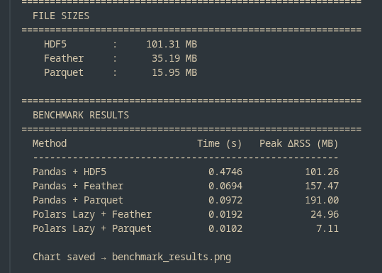

# RADIS Lazy-Loading Benchmark 

A straightforward benchmark to find the most memory-efficient way to load massive spectroscopic databases (like HITRAN/HITEMP) for the RADIS GSoC 2026 project.

The main issue right now is that Pandas eager loading causes RAM crashes with 50GB+ files. Since Vaex is unmaintained, we need a reliable lazy-loading alternative.

##  What this script does
Instead of using fake random numbers, this script fetches **real CO2 HITRAN data** (wavenumber 500 – 10000 cm⁻¹) using `radis.fetch_hitran`. This is important because real spectroscopic data compresses very differently than random floats.

It compares:
- **Formats:** HDF5 (current), Feather, and Parquet (Snappy compression).
- **Engines:** Pandas (Eager) vs. Polars (Lazy).

##  How to run it
```bash
pip install -r requirements.txt
python benchmark_script.py
```

### The Results
Here is the direct output from the benchmark run on the CO2 dataset:



And the visual summary generated by the script:


💡 Quick Takeaway
RAM Efficiency: Polars (Lazy) + Parquet completely solves the memory issue, dropping peak RAM usage to just ~7 MB compared to Pandas which spikes over 150+ MB.

Storage: Parquet's snappy compression shrinks the CO2 data from 101 MB (HDF5) down to just 16 MB.

Conclusion: Moving to a Polars + Parquet stack is the optimal path forward to fix the RAM bottlenecks without relying on Vaex.