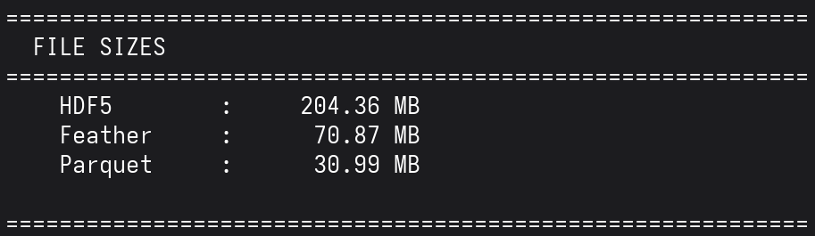
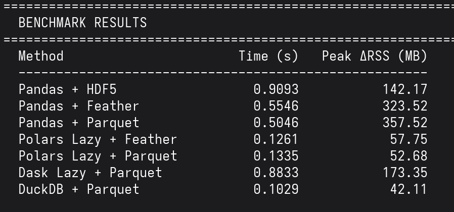
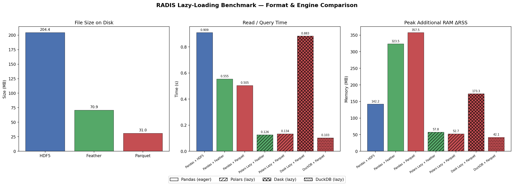

# RADIS Lazy-Loading Benchmark

**GSoC 2026 Project: Finding a replacement for Vaex in RADIS**

RADIS uses massive spectroscopic databases (HITRAN/HITEMP) that can exceed 50GB. Currently, Pandas loads everything into RAM at once, causing crashes on normal computers. Vaex solved this with lazy-loading, but it's now unmaintained and **doesn't work on Python 3.12+**.

This benchmark tests modern alternatives to find the best replacement.

---

## The Problem

- **Pandas** loads entire files into RAM  crashes with large databases
- **Vaex** is unmaintained since 2022  no bug fixes, no updates
- **Vaex** uses deprecated `imp` module  won't install on Python 3.12+

---

## What We Test

**Dataset:** Real CO2 spectroscopic data from HITRAN  
- 1,059,080 spectral lines
- Wavenumber range: 500-15000 cm⁻¹

**File Formats:** HDF5, Feather, Parquet

**Engines:** Pandas, Polars, Dask, DuckDB

---

## How to Run

```bash
# 1. Install dependencies
pip install -r requirements.txt

# 2. Run the benchmark
python benchmark_script.py
```

That's it! The script will:
1. Download real CO2 data from HITRAN
2. Save it in 3 formats (HDF5, Feather, Parquet)
3. Run each benchmark in an **isolated subprocess** (for accurate memory measurement)
4. Generate charts

---

## Results

### File Size Comparison

Parquet compresses spectroscopic data extremely well — **6.6x smaller** than HDF5:



---

### Memory Usage (Peak RAM)

This is the key metric. Each engine runs in its own subprocess to get accurate memory readings:



---

### Full Benchmark Results



---

## Conclusion

### Winner: DuckDB + Parquet
- Fastest (0.09s) and lowest memory (42 MB)

### Runner-up: Polars + Parquet
- Very fast (0.16s), low memory (53 MB), pure Python API

### Recommendation for RADIS

Replace Vaex with **Polars** or **DuckDB** using **Parquet** format. This solves the RAM problem and works on modern Python.

---

## Why Not Vaex?

```
$ pip install vaex
ERROR: ModuleNotFoundError: No module named 'imp'
```

Vaex cannot be installed on Python 3.12+ because it uses the `imp` module which was removed. This benchmark proves we have better alternatives anyway.
